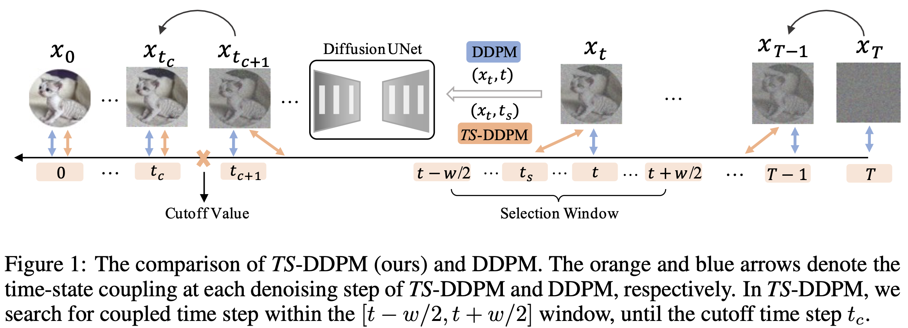

# Alleviating Exposure Bias in Diffusion Models through Sampling with Shifted Time Steps
This repo contains the official implementation for the paper [Alleviating Exposure Bias in Diffusion Models through Sampling with Shifted Time Steps](https://arxiv.org/pdf/2305.15583.pdf)  


by [Mingxiao Li*](https://github.com/Mingxiao-Li), Tingyu Qu*, Ruicong Yao, Wei Sun, Marie-Francine Moens. International Conference on Representation Learning 2024 (ICLR'24).

## Abstract
<div stype="text-align: left;">
Denoising Diffusion Probabilistic Models (DDPM) have shown remarkable efficacy in the synthesis of high-quality images. However, their inference process characteristically requires numerous, potentially hundreds, of iterative steps, which could lead to the problem of exposure bias due to the accumulation of prediction errors over iterations. Previous work has attempted to mitigate this issue by perturbing inputs during training, which consequently mandates the retraining of the DDPM. In this work, we conduct a systematic study of exposure bias in diffusion models and, intriguingly, we find that the exposure bias could be alleviated with a new sampling method, without retraining the model. We empirically and theoretically show that, during inference, for each backward time step  and corresponding state , there might exist another time step  which exhibits superior coupling with . Based on this finding, we introduce an inference method named Time-Shift Sampler. Our framework can be seamlessly integrated with existing sampling algorithms, such as DDIM or DDPM, inducing merely minimal additional computations. Experimental results show that our proposed framework can effectively enhance the quality of images generated by existing sampling algorithms.
</div>

## Illustration of Our Method


## What does this codebase contain ?

This codebase comprises the integration of our TS-method with a wide array of popular diffusion samplers including [DDIM](https://arxiv.org/pdf/2010.02502.pdf), [PNDM](https://arxiv.org/pdf/2202.09778.pdf), [DPM-Solver](https://arxiv.org/abs/2206.00927), and [DEIS] (https://arxiv.org/abs/2204.13902). 

For the implementation of our method on [ADM](https://arxiv.org/pdf/2105.05233.pdf) backbone, please visit [this repo](https://github.com/tingyu215/TS-DPM-ADM).

This code base also contains the implementation of ES-Samplers on original DPM backbone proposed in **[Elucidating The Exposure Bias in Diffusion Models](https://arxiv.org/pdf/2308.15321.pdf)** by Mang Ning, Mingxiao Li, Jianlin Su, Albert Ali Salah, and Itir Onal Ertugrul. For the implementarions of ES-Samplers on [ADM](https://arxiv.org/pdf/2105.05233.pdf) and [EDM](https://arxiv.org/pdf/2206.00364.pdf), please visit [ADM-ES repo] (https://github.com/forever208/ADM-ES) and [EDM-ES repo](https://github.com/forever208/EDM-ES).

## Installation
```
git clone https://github.com/Mingxiao-Li/TS-DPM.git
cd  TS-DPM
conda env create -f environment.yml
```
## Prepare Dataset for Evaluation

## How to Run Different Samplers?
```
python run_generate.py
--config   # the path to the config file (eg ./config/ddim-cifar10.yml), which contains the configurations of dataset and model
--model DDIM # by default, we use ddim
--model_path # the path to save pretrained model weights
--sampler  # select diffusion samplers, in our implementation this could be pnm_solver, dpm-solver,or deis 
--batch_size 512  
--total_num_img 50000 
--method   # for pndm_solver, this args specify the oder of sovler,eg: f-pndm(4th order), s-pndm(2nd order) euler(1st order). For dpm-solver and deis, this arg does nothing. 
--sample_speed # number of sampling steps 
--dataset  # which dataset (cifar, celeba, LSUN..)
--time-shift  # if use TS algorithm
--window_size # specify the window size used in TS algorithm
--cut_off_value # specify the cut of value used in TS algorithm
```

Example of running F-PNDM (4th order) solver with TS using cifar-10 DDIM backbone:
```
python run_generate.py \
--config ddim_cifar10.yml \
--model DDIM \
--model_path /TS-DPM/models/ddim_cifar10.ckpt \
--sampler pnm_solver \
--batch_size 256 \
--total_num_imgs 50000 \
--method f_pndm \
--sample_speed 100 \
--dataset cifar \
--time_shift \
--window_size 5 \
--cut_off_value 550
```
Example of running dpm solver with TS using cifar-10 DDIM backbone:
```
python run_generate.py \
--config ddim_cifar10.yml \
--model DDIM \
--model_path /models/ddim_cifar10.ckpt \
--sampler dpm-solver \
--batch_size 1024 \
--total_num_imgs 50000 \
--sample_speed 5 \
--dataset cifar \
--method dpm-solver-order2-w30-c300 \ # here is just the name of the file to save generated images
--time_shift \
--window_size 30 \
--cut_off_value 300
```
Example of running deis solver with TS using cifar-10 DDIM backbone:
```
CUDA_DEVICE_ORDER="PCI_BUS_ID" \
CUDA_VISIBLE_DEVICES=1 \
python run_generate.py \
--config ddim_cifar10.yml \
--model DDIM \
--model_path /models/ddim_cifar10.ckpt \
--sampler deis \
--batch_size 1024 \
--total_num_imgs 50000 \
--sample_speed 5 \
--dataset cifar \
--method deis-order2-ts-w10-cutoff-900 \ # here is just the name of the file to save generated images
--time_shift \
--window_size 10 \
--cut_off_value 900
```


